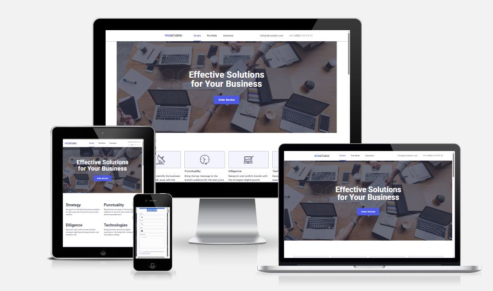

# Company Presentation Website

---

**Individual Project**

---

## 📌 Overview

This is a clean and modern **one-page presentation website** developed to showcase a company, its team, portfolio, and contact information. The website includes a call-to-action button for ordering the service.  
The project follows a **mobile-first approach**, ensuring smooth usability across all devices — **mobile, tablet, and desktop**.

---

## 🛠️ Tech Stack

---

## 🎯 Key Features

- **Team Section** — photo gallery presenting team members
- **Portfolio Section** — examples of completed projects
- **Contact Section** — essential information for communication
- **Service Order Button** — quick and easy CTA
- **Responsive Design**

---

## 📸 Screenshots

